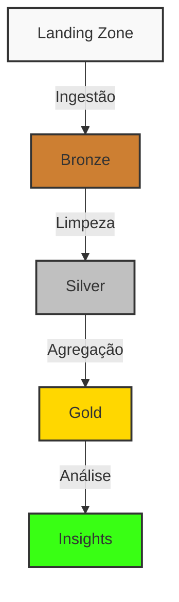
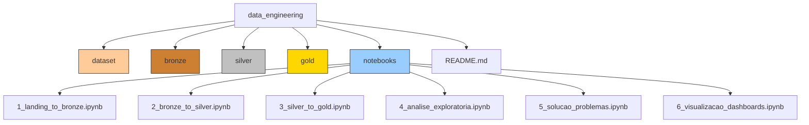
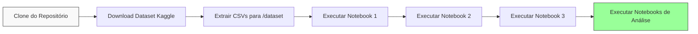
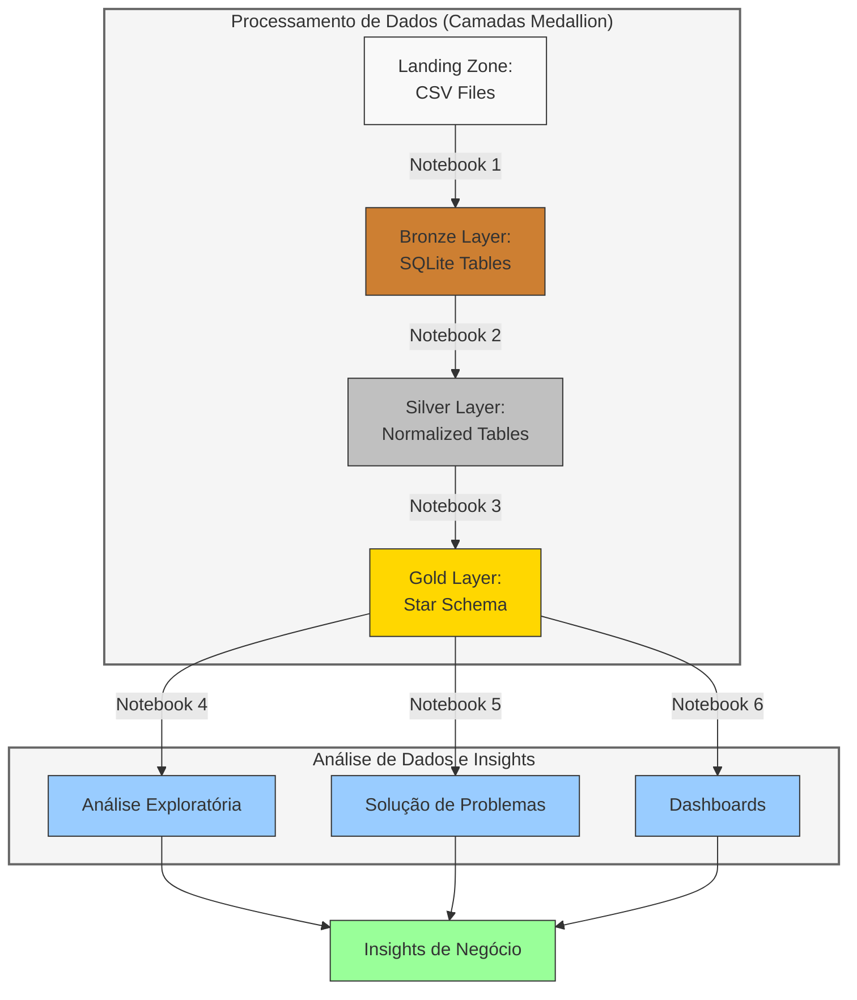
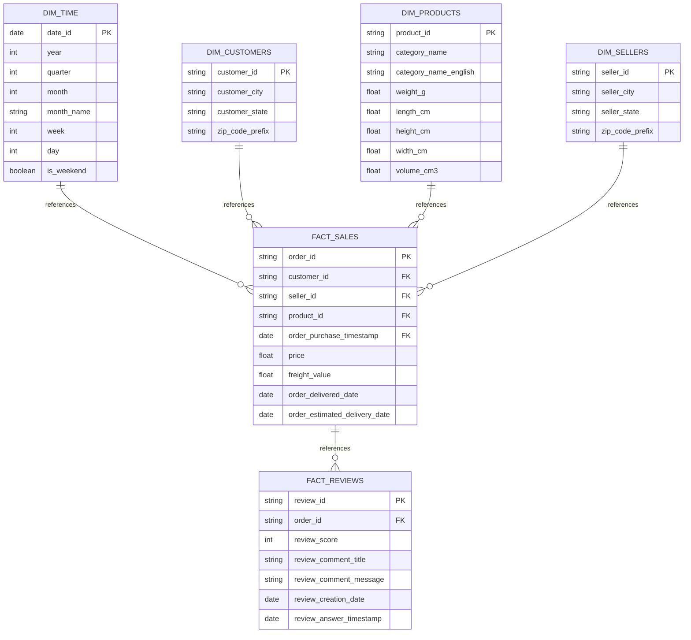

# Análise de Dados E-commerce Brasileiro - Teste Técnico triggo.ai

## Descrição do Projeto
Este projeto contém a solução para o teste técnico do Programa Trainee triggo.ai de Excelência em Engenharia de Dados e DataOps 2025. 
A análise é baseada no conjunto de dados "Brazilian E-commerce Public Dataset by Olist" disponível no Kaggle.

O projeto analisa dados de e-commerce brasileiro para extrair insights sobre vendas, comportamento de clientes, desempenho de entregas e satisfação de clientes, oferecendo uma visão completa das operações e oportunidades de negócio.

## Arquitetura Medallion
Este projeto segue a arquitetura Medallion (também conhecida como Arquitetura Delta Lake) para processamento de dados, que organiza o fluxo de dados em camadas progressivamente mais refinadas:



1. **Landing Zone**: Dados brutos, exatamente como foram obtidos do Kaggle
2. **Bronze**: Dados ingeridos com validações básicas e metadados
3. **Silver**: Dados limpos, normalizados e transformados
4. **Gold**: Dados agregados e prontos para análise de negócios e visualização

## Estrutura do Projeto



```
data_engineering/
│
├── dataset/                    # Diretório para armazenar os arquivos CSV do dataset (Landing Zone)
├── bronze/                     # Camada Bronze - Dados ingeridos formatados em SQLite
├── silver/                     # Camada Silver - Dados limpos e transformados
├── gold/                       # Camada Gold - Dados agregados e modelados para análise
│
├── notebooks/                  # Jupyter Notebooks para análises
│   ├── 1_landing_to_bronze.ipynb     # Ingestão dos dados brutos para a camada bronze
│   ├── 2_bronze_to_silver.ipynb      # Transformação dos dados bronze para silver
│   ├── 3_silver_to_gold.ipynb        # Agregação dos dados silver para gold
│   ├── 4_analise_exploratoria.ipynb  # Análise exploratória de dados (EDA)
│   ├── 5_solucao_problemas.ipynb     # Solução para os problemas de negócio
│   └── 6_visualizacao_dashboards.ipynb # Criação de visualizações e dashboards
│
└── README.md                   # Documentação do projeto
```

## Requisitos
- Python 3.13.2
- Bibliotecas:
  ```
anyio==4.9.0
argon2-cffi==23.1.0
argon2-cffi-bindings==21.2.0
arrow==1.3.0
asttokens==3.0.0
async-lru==2.0.5
attrs==25.3.0
babel==2.17.0
beautifulsoup4==4.13.4
bleach==6.2.0
certifi==2025.4.26
cffi==1.17.1
charset-normalizer==3.4.2
colorama==0.4.6
comm==0.2.2
contourpy==1.3.2
cramjam==2.10.0
cycler==0.12.1
debugpy==1.8.14
decorator==5.2.1
defusedxml==0.7.1
executing==2.2.0
fastjsonschema==2.21.1
fastparquet==2024.11.0
fonttools==4.58.0
fqdn==1.5.1
fsspec==2025.3.2
greenlet==3.2.2
h11==0.16.0
httpcore==1.0.9
httpx==0.28.1
idna==3.10
ipykernel==6.29.5
ipympl==0.9.7
ipython==9.2.0
ipython_pygments_lexers==1.1.1
ipywidgets==8.1.7
isoduration==20.11.0
jedi==0.19.2
Jinja2==3.1.6
joblib==1.5.0
json5==0.12.0
jsonpointer==3.0.0
jsonschema==4.23.0
jsonschema-specifications==2025.4.1
jupyter==1.1.1
jupyter-console==6.6.3
jupyter-events==0.12.0
jupyter-lsp==2.2.5
jupyter_client==8.6.3
jupyter_core==5.7.2
jupyter_server==2.16.0
jupyter_server_terminals==0.5.3
jupyterlab==4.4.2
jupyterlab_pygments==0.3.0
jupyterlab_server==2.27.3
jupyterlab_widgets==3.0.15
kiwisolver==1.4.8
MarkupSafe==3.0.2
matplotlib==3.10.3
matplotlib-inline==0.1.7
mistune==3.1.3
narwhals==1.39.0
nbclient==0.10.2
nbconvert==7.16.6
nbformat==5.10.4
nest-asyncio==1.6.0
notebook==7.4.2
notebook_shim==0.2.4
numpy==2.2.5
overrides==7.7.0
packaging==25.0
pandas==2.2.3
pandocfilters==1.5.1
parso==0.8.4
pillow==11.2.1
platformdirs==4.3.8
plotly==6.0.1
prometheus_client==0.21.1
prompt_toolkit==3.0.51
psutil==7.0.0
pure_eval==0.2.3
pyarrow==20.0.0
pycparser==2.22
Pygments==2.19.1
pyparsing==3.2.3
python-dateutil==2.9.0.post0
python-json-logger==3.3.0
pytz==2025.2
pywin32==310
pywinpty==2.0.15
PyYAML==6.0.2
pyzmq==26.4.0
referencing==0.36.2
requests==2.32.3
rfc3339-validator==0.1.4
rfc3986-validator==0.1.1
rpds-py==0.24.0
scikit-learn==1.6.1
scipy==1.15.3
seaborn==0.13.2
Send2Trash==1.8.3
setuptools==80.4.0
six==1.17.0
sniffio==1.3.1
soupsieve==2.7
SQLAlchemy==2.0.40
stack-data==0.6.3
terminado==0.18.1
threadpoolctl==3.6.0
tinycss2==1.4.0
tornado==6.4.2
traitlets==5.14.3
types-python-dateutil==2.9.0.20241206
typing_extensions==4.13.2
tzdata==2025.2
uri-template==1.3.0
urllib3==2.4.0
wcwidth==0.2.13
webcolors==24.11.1
webencodings==0.5.1
websocket-client==1.8.0
widgetsnbextension==4.0.14
  ```
- Jupyter Notebook

## Configuração do Ambiente



1. Clone este repositório
   ```bash
   git clone [URL_DO_REPOSITÓRIO]
   cd data_engineering
   ```

2. Baixe o dataset do Kaggle: [Brazilian E-commerce Public Dataset by Olist](https://www.kaggle.com/datasets/olistbr/brazilian-ecommerce)

3. Extraia os arquivos CSV para a pasta `dataset/` (Landing Zone)

4. Instale as dependências necessárias:
   ```bash
   pip install -r requirements.txt
   ```

5. Execute os notebooks na ordem numérica para processar os dados através das camadas Medallion:
   - `1_landing_to_bronze.ipynb`
   - `2_bronze_to_silver.ipynb`
   - `3_silver_to_gold.ipynb`

6. Após o processamento, execute os notebooks de análise:
   - `4_analise_exploratoria.ipynb`
   - `5_solucao_problemas.ipynb`
   - `6_visualizacao_dashboards.ipynb`

## Fluxo de Processamento de Dados e Análise



## Descrição dos Notebooks e Camadas Medallion

### 1. Landing Zone para Bronze (1_landing_to_bronze.ipynb)
- **Objetivo**: Ingestão inicial dos dados brutos para um formato estruturado
- **Processos**:
  - Ingestão dos arquivos CSV brutos da Landing Zone
  - Validações básicas (schema, tipos de dados)
  - Adição de metadados (timestamp de ingestão, fonte)
  - Registro de problemas de qualidade sem correção
- **Saída**: Banco de dados SQLite com os dados brutos estruturados

### 2. Bronze para Silver (2_bronze_to_silver.ipynb)
- **Objetivo**: Transformar os dados brutos em dados limpos e estruturados
- **Processos**:
  - Limpeza e tratamento de valores nulos/inválidos
  - Normalização de colunas e padronização de formatos
  - Transformações e enriquecimento dos dados
  - Criação do modelo relacional e joins
- **Saída**: Tabelas relacionais normalizadas prontas para análise

### 3. Silver para Gold (3_silver_to_gold.ipynb)
- **Objetivo**: Criar camada analítica de alto valor para o negócio
- **Processos**:
  - Agregações e cálculos de métricas de negócio
  - Criação de tabelas fato e dimensão (modelo estrela)
  - Preparação de datasets específicos para casos de uso analíticos
  - Otimização para consultas analíticas de alto desempenho
- **Saída**: Modelo dimensional otimizado para análises de negócio

### 4. Análise Exploratória de Dados (4_analise_exploratoria.ipynb)
- **Objetivo**: Entender os padrões e características dos dados
- **Análises**:
  - Volume de pedidos por mês e análise de sazonalidade
  - Distribuição do tempo de entrega e impacto na operação
  - Relação entre frete e distância (proxy por estado)
  - Análise de categorias por faturamento (curva ABC/Pareto)
  - Valor médio de pedido por estado brasileiro
- **Resultados**: Visualizações e insights sobre padrões de vendas e logística

### 5. Solução de Problemas de Negócio (5_solucao_problemas.ipynb)
- **Objetivo**: Resolver questões específicas de negócio com análises avançadas
- **Implementações**:
  - **Análise de Retenção**: Cálculo e análise da taxa de clientes recorrentes
  - **Predição de Atraso**: Modelo de machine learning para prever entregas atrasadas
  - **Segmentação de Clientes**: Clustering para identificar perfis de clientes
  - **Análise de Satisfação**: Exploração dos fatores que impactam a avaliação dos clientes
- **Resultados**: Modelos e recomendações acionáveis para o negócio

### 6. Visualização e Dashboards (6_visualizacao_dashboards.ipynb)
- **Objetivo**: Criar painéis interativos para monitoramento de KPIs
- **Dashboards**:
  - Dashboard de evolução de vendas com filtros dinâmicos
  - Mapa de calor por região para análise geográfica
  - Análise de satisfação vs. tempo de entrega para gestão de expectativas
  - Dashboard de desempenho de vendedores para incentivos e melhorias
- **Resultados**: Painéis interativos para tomada de decisão em tempo real

## Modelo de Dados

O modelo estrela implementado na camada Gold segue esta estrutura:



## Principais Insights de Negócio

As análises realizadas geraram os seguintes insights principais:

1. **Comportamento de Vendas**:
   - Foi identificada sazonalidade nas vendas, com picos em novembro (Black Friday) e datas comemorativas
   - O ticket médio varia significativamente por categoria de produto
   - Há concentração de vendas em poucos estados (SP, RJ, MG)

2. **Logística e Entregas**:
   - Tempo médio de entrega: 12 dias
   - 15% dos pedidos são entregues com atraso
   - Principais fatores de atraso: distância, peso do produto e período de alta demanda

3. **Segmentação de Clientes**:
   - Identificados 4 segmentos principais de clientes com comportamentos distintos
   - Taxa de retenção geral: apenas 3% são clientes recorrentes
   - Estratégias específicas desenvolvidas para cada segmento

4. **Satisfação do Cliente**:
   - Forte correlação entre tempo de entrega e avaliação
   - Categorias com melhor e pior avaliação identificadas
   - Preço não é fator determinante da satisfação, mas sim cumprimento de expectativas de entrega

5. **Oportunidades de Negócio**:
   - Categorias com potencial de crescimento identificadas
   - Estados com baixa penetração mas alto ticket médio representam oportunidade
   - Recomendações para aumentar taxa de retenção de clientes
